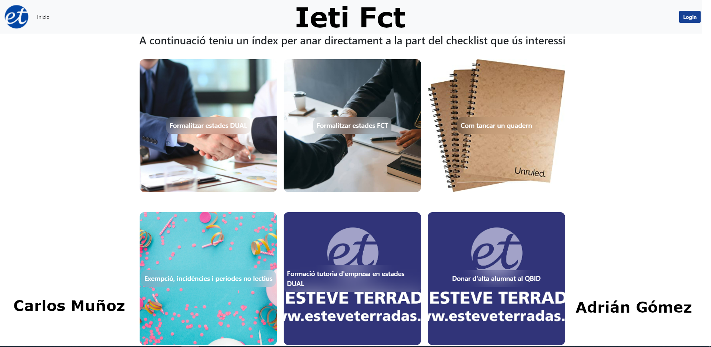

# IETIFCT

## ¿Qué es este proyecto?

Es una web pensada para poder subir procedimientos, con la finalidad de presentarlos de una manera sencilla y clara.

## ¿Para quién es este proyecto?

Esta aplicación está pensada para personas que quieren transmitir procedimientos complejos de una manera nítida, con acompañamiento de imágenes y texto.

## Algunos ejemplos:

